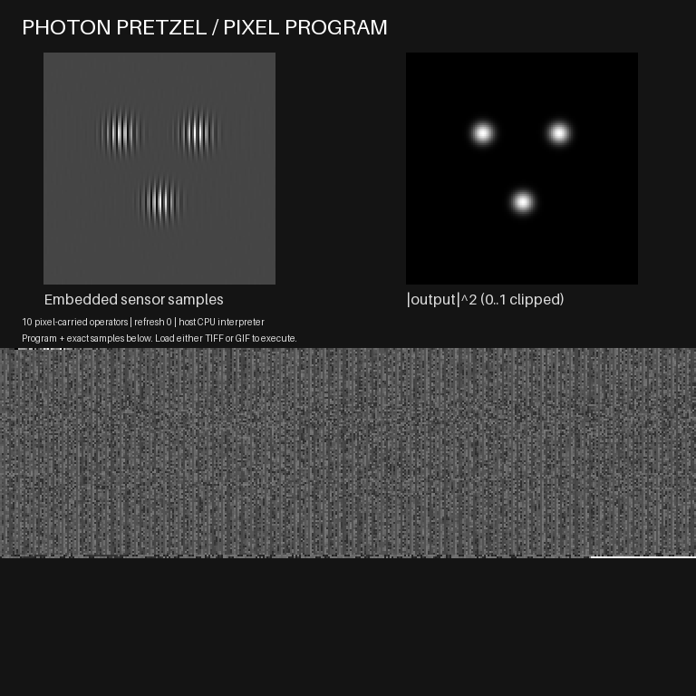

# Photon Pretzel Holograms

**Version 0.3.0 — executable TIFF/GIF programs with embedded optical sensor data.**

The image carries both **the instructions and the exact input samples**. A compatible, bounded array interpreter reads its pixels and executes the encoded sequence of FFTs, masks, shifts, multiplication and propagation operations. The output is saved as a fresh executable TIFF and GIF; either can be loaded and executed again. A valid change to the encoded instructions changes the calculation without changing the runtime.



Computation takes place on the host CPU. TIFF and GIF viewers display these files; they do not execute them. This is a discrete optical simulation, with no optical hardware, physical measurement, SLM driver, camera calibration, or full Penteract workstream qualification.

## Run it

Python 3.12 or newer is recommended. This standalone project needs neither an OCR installation nor another demo repository or personal folder.

```text
python -m venv .venv
```

Activate the environment using your operating system's usual command, then:

```text
python -m pip install -r requirements.txt
python run.py generate --out results/first
python run.py inspect-carrier results/first/processing.gif
python run.py replay-carrier results/first/processing.gif --out results/from-gif
python run.py replay-carrier results/first/processing.tiff --out results/from-tiff
python run.py replay-carrier results/from-gif/processing.tiff --out results/refreshed-again
```

Each command requires a **new output directory**. Existing paths are refused and source bytes are preserved. Every replay reads one bounded image snapshot, verifies every frame, executes the decoded graph and writes freshly rendered executable images.

To change the actual pixel program, append a scale instruction:

```text
python run.py edit-carrier results/first/processing.gif --gain 0.5 --out results/edited
python run.py replay-carrier results/edited/processing.tiff --out results/edited-again
```

The edited field is exactly half the original field and its intensity is one quarter, with the same runtime. The right image panel uses a fixed intensity display range of 0 to 1, so this change is visible. The edit is in the image's instruction list; it does not alter the sensor samples or Python runtime. [Recorded program-edit evidence](evidence/executable_results.json) covers both formats and replay of their refreshed output.

The separate numerical TIFF can be inspected or compiled into a pixel program:

```text
python run.py inspect results/first/hologram_uint16.tiff
python run.py reconstruct results/first/hologram_uint16.tiff --out results/from-numerical-tiff
python run.py generate --scene holdout --distance 0.01 --out results/holdout
python -B verify.py
python run.py --version
```

`distance` is in metres, from -0.02 to +0.02. `inspect` validates the restricted numerical TIFF profile; `inspect-carrier` reports the executable image's instructions, output reference and input hash. Invalid input returns exit code 2 with a JSON error.

## What the image executes

The default graph is authored when a numerical hologram is generated or imported. **Replay never invokes the scene generator, compiler, demodulator or a hidden optical reconstruction routine.** It executes the instructions decoded from the image:

1. Scale the embedded uint16 samples to intensity.
2. FFT, roll the selected sideband, construct a disk mask, and multiply.
3. Inverse FFT to recover the sensor field.
4. Construct the encoded transfer function; FFT the field, multiply, and inverse FFT.

The runtime is a straight-line array machine. Its eight permitted primitives are `scale`, `fft2`, `ifft2`, `roll`, `disk`, `multiply`, `transfer`, and `abs2`. Instructions have unique names and reference earlier arrays. The pixel program specifies all operators, operands, order, parameters and the selected output. There is no runtime `kind`, scene identifier, template selector, command, URL, filesystem input reference, or callback in the executable payload. A two-instruction non-optical scale/square graph is also tested, including an order change that changes the result.

The single input is a 128 by 128 array of exact unsigned 16-bit samples, stored as canonical base64 of little-endian bytes in the packet. Its scale is an explicit graph instruction. The accompanying `program.json` is for inspection; the image interpreter does not read that sidecar. Deleting sidecars does not remove the program or its samples from a carrier.

A packet has an 8-byte versioned magic, 4-byte big-endian payload length, SHA-256, then canonical ASCII JSON. Each byte is stored as one uniform 2 by 2 grayscale pixel cell. The 768 by 768 image uses the area starting at row 384 for data. An exact 256-level grayscale palette preserves bytes in GIF. Every frame must carry the same program. The checksum detects accidental changes; it is neither a signature nor authorization.

The right panel displays the magnitude-squared of the output array, clipped to the fixed display range [0,1]. Numerical arrays retain full float64 precision and are not clipped. The left sensor panel is display-normalized. The two animation frames mark refresh counts; each contains the whole executable payload. They are not a claim of a physical time-dependent optical process.

## Output files

| File | Meaning |
|---|---|
| `processing.gif`, `processing.tiff` | Executable program, embedded samples, and refreshed display. Both formats can be loaded by `replay-carrier`. |
| `program.json` | Human-readable copy of the pixel program, including samples. Optional inspection sidecar. |
| `reconstruction.npz` | Float64 real and imaginary output arrays. Load with `numpy.load(..., allow_pickle=False)`. |
| `reconstructed_intensity.png` | Display-normalized intensity derivative. This PNG has no executable packet. |
| `hologram_uint16.tiff` | Generated 128 by 128 numerical intensity plane with a bounded optical profile in ImageDescription. |
| `target_intensity.png`, `optical_profile.json` | Reference target and declared simulation conventions, generated with the synthetic scene. |
| `receipt.json` | Generation/import metrics, source and execution hashes, operator trace and export checks. |
| `replay_receipt.json`, `edit_receipt.json` | Source byte hash, executed instruction/result hashes, frame checks and replay/edit evidence. |

For an arbitrary imported numerical TIFF or edited program, quality against an unknown physical target is **NOT_ASSESSED**. Only the supplied synthetic reference scenes receive the frozen reconstruction acceptance check. Byte/result hashes do not establish physical correctness or sender authenticity.

## Frozen optical reference model

- Scalar monochromatic periodic grid, medium index 1, wavelength **532 nm**, sampling pitch **8 micrometres**, shape **128 by 128**.
- Array axes `[y,x]`; target at z=0, sensor at the supplied distance. Harmonic convention `exp(-i omega t)`.
- Angular-spectrum transfer `exp(+i 2*pi*z*sqrt(1/lambda^2-fx^2-fy^2))`.
- Forward FFT unnormalized; inverse scaled by 1/N^2; unshifted frequency ordering. No padding, crop or physical aperture model.
- The reference scene has object support radius **10 Fourier bins**, a reference at **+40 x-bins**, and selects the **-40 sideband**. The frozen model keeps sidebands and autocorrelation separate.
- Sensor intensity is quantized to uint16 using nearest ties-to-even; `intensity = sample * scale / 65535`, with scale in (0,16].
- Evanescent support is discarded for nonzero propagation and zero distance is identity. The fixed sampling envelope contains no evanescent bins.

The compiler emits this reference calculation as editable instructions. Permitted graph edits can depart from the reference reconstruction, so they do not inherit its quality claim. Transfer nodes retain the fixed wavelength/pitch envelope, bounded distance and declared conventions.

Tests cover 15 analytic plane-wave cases, both propagation signs, exact zero-distance identity, and eight training/held-out reconstruction cases. Acceptance is frozen at **0.001 relative complex L2** and **1e-8 analytic maximum absolute error**. Executable tests also disable hidden optical routines during execution, modify instruction order, mask radius, propagation distance and embedded samples, and verify that edits change the result with the runtime unchanged.

## Bounds and failure behavior

A source image is a regular file read once with an **8 MiB** cap. An executable image must have exact dimensions, at most **32 frames**, at most **56,000 payload bytes**, exactly **32,768 sensor bytes**, and **1 to 24 instructions**. The acyclic straight-line graph permits only the listed primitives and earlier references. All arrays are fixed at 128 by 128 complex128. Every intermediate must be finite with magnitude at most 1e12. Scalar factors are bounded to +/-16, roll offsets are exact integers within +/-127, disk radius is in [0,32], and propagation is within +/-0.02 m. Unknown operations, fields, references, noncanonical JSON, damaged cells, mixed frame programs and exceeded limits are rejected.

The numerical TIFF reader requires one 128 by 128 unsigned 16-bit plane and at most 2 KiB of closed-schema ASCII metadata. It probes just a second plane instead of counting an unlimited TIFF chain. It rejects duplicate metadata keys, nonfinite values, incorrect integer bins, signed/floating-point/Boolean samples and unsupported physical-measurement claims.

The interpreter does not execute Python text, shell commands, URLs, pickle objects or external paths from an image. Output destinations come from the caller. Validation and trial execution happen before creating replay/edit output directories. Failed new exports may leave partial files in their new directory; prior results and input sources are not overwritten. Pillow remains an external parser dependency. This scoped audit does not claim exhaustive hostile-input proof or physical/device qualification.

## Evidence and history

- [Audit findings and fixes](audit.json)
- [Executed test results](evidence/test_results.json) and [test log](evidence/test_log.txt)
- [Numerical reference cases](evidence/numerical_results.json)
- [Executable image and program-edit evidence](evidence/executable_results.json)
- [Changelog](CHANGELOG.md)

`demo-v0.3.0/` contains the current executable examples; `demo-v0.3.0-edited/` contains the altered program. `demo-v0.2.0/` retains historical scene-selector jobs, which do **not** meet the v0.3 executable-program standard and are rejected by the current carrier loader. The older `demo/` contains a numerical-only baseline with a display GIF. Their numerical uint16 TIFF files remain importable through `reconstruct`.

The optical kernel originated in the TIFF/GIF Compute Lab 0.1.0 research demonstration. This repository contains its optical code and generated reference assets, with no private workflow archives, source corpora, OCR binaries, personal paths or binary runtimes.

## License

**The whole Photon Pretzel Holograms project is licensed under GNU General Public License version 3 only (`GPL-3.0-only`).** This includes source code, tests, documentation, audit/evidence records and generated demonstration assets, except where an individual file explicitly states otherwise. See [LICENSE](LICENSE) for the full text.

NumPy and Pillow are external dependencies, not relicensed or vendored by this project; their own licenses apply to their code. This software is provided without warranty, as described in the GPL.
