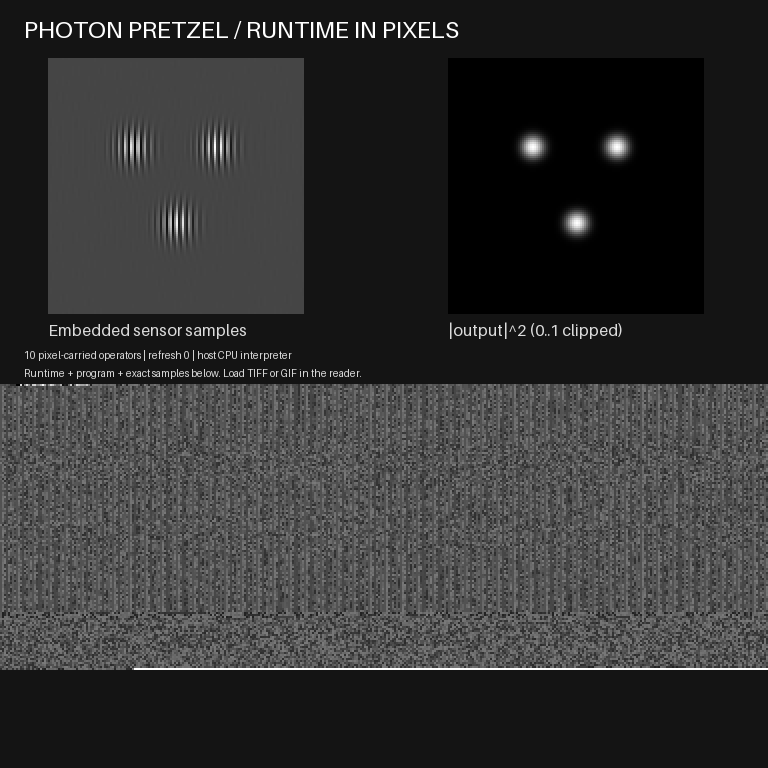

# Photon Pretzel Holograms

**Version 0.4.0 — a Windows optical-simulation reader whose TIFF/GIF images carry their interpreter runtime, operator program and input samples.**

## Open the ready-to-run application

Download **Photon-Pretzel-0.4.0-win-x64.zip** from the [Releases page](https://github.com/LKVexa/photon-pretzel-holograms/releases). Extract the **whole ZIP**, then double-click **Play.cmd** or **OpticalPlayer.exe**. The included image opens and computes automatically. Keep the extracted files together.

The automatically generated GitHub **Source code (zip)** is developer source, not the Windows app. The Windows package includes its .NET runtime; using it requires no Python, SDK, build command, internet connection or administrator access.



- **Run image** reads the current pixels and executes their program again.
- **Apply gain** appends a scale instruction inside the image. Gain 0.5 halves the complex field and quarters intensity, without changing its runtime.
- **Save TIFF + GIF** creates a new folder, reopens both formats and verifies identical computation.
- **Open image** loads a saved image. **Reset demo** returns to the original input.

The left panel shows stored sensor samples; the right shows output intensity on a fixed [0,1] display scale. After 24 operators, reopen the original demo to make further edits. Source files and existing output folders are preserved.

## What lives in the pixels

Every current carrier holds a compiled **ArrayRuntime.dll** module compressed as gzip/base64, an ordered array program, and exact 128 by 128 uint16 input samples. The C# reader checks a build-time approved SHA-256 before loading the module **from pixel bytes** into memory. It has no project reference to ArrayRuntime and ships no adjacent ArrayRuntime.dll fallback. Unknown or altered modules are rejected before loading.

The carried module supports eight generic operations: `scale`, `fft2`, `ifft2`, `roll`, `disk`, `multiply`, `transfer`, and `abs2`. The pixel program selects operations, operands, order, parameters and the output array. It has no scene selector, hidden reconstruction pipeline, external input path, shell, URL or callback. The default graph scales intensity, selects a Fourier sideband, recovers a complex field and propagates it. Non-optical programs and changes to operator order are also tested.

The refreshed image preserves the full runtime, program and original sensor samples. Reopening it recomputes the output. The **packaged native reader requires no runtime/program/data sidecar**. Output is a reproducible result; it is not silently substituted as new sensor input.

**The host CPU executes the image-carried runtime.** A normal image viewer only displays the image. This is a bounded numerical simulation, not physical optical hardware or a file that runs by itself. A compatible reader and general .NET execution platform remain necessary; the Windows package includes both. A pinned hash approves code for this reader build; it is not a digital signature or sender authentication.

## Bounds and failure behavior

The 768 by 768 image stores bytes in uniform 2 by 2 grayscale cells below row 384. The packet contains `PPHVM004`, a four-byte big-endian length, SHA-256, and canonical ASCII JSON with exactly `schema`, `program_json`, and `runtime`. The inner program is a JSON string so floating-point representations survive outer canonicalization. GIF has an exact 256-level grayscale palette. Every frame must contain the same full envelope.

The native reader takes one regular-file snapshot of at most **32 MiB**. Before GDI+ decoding, it screens classic TIFF/GIF dimensions, offsets, strips, page cycles and at most **32 frames**. Limits are **72,000 envelope bytes**, **56,000 program characters**, **24,000 encoded module characters**, and **128 KiB decompressed module bytes**. The exact approved module hash is mandatory.

The interpreter permits **1–24** instructions with references only to earlier arrays and exactly **32,768 sensor bytes**. Arrays are fixed 128 by 128 complex128; all intermediates must be finite with magnitude at most 1e12. Scale is within +/-16, integer rolls within +/-127, mask radius within [0,32] bins and propagation within +/-0.02 metres. Duplicate/unknown fields, nonfinite values, malformed samples, invalid references, inconsistent frames and resource growth are rejected.

Failed new exports can leave partial files in their new directory. GDI+ remains the platform decoder after structural screening; this is not exhaustive hostile-input certification. If Windows organizational policy blocks the unsigned application, follow the administrator's approved process rather than disabling protections.

## Numerical model and evidence

The frozen reference is a periodic scalar monochromatic 128 by 128 grid, wavelength **532 nm**, pitch **8 micrometres**, medium index 1, axes `[y,x]`, harmonic convention `exp(-i omega t)`. Transfer is `exp(+i 2*pi*z*sqrt(1/lambda^2-fx^2-fy^2))`. Forward FFT is unnormalized; inverse scales by 1/N²; frequencies are unshifted. The object support radius is 10 Fourier bins, reference carrier +40 x-bins, selected sideband -40. There is no padding, calibration or physical aperture model. Intensity is quantized to uint16 with nearest ties-to-even: `intensity = sample * scale / 65535`, scale in (0,16]. Zero-distance transfer is identity; this sampling envelope contains no evanescent bins.

The independent Python/NumPy implementation remains the authoring and numerical oracle. It does **not** load the C# module; its optional reference CLI uses `runtime-payload.json` for the approved hash. The native reader is the runtime-from-pixels path. C# and NumPy FFT rounding can differ; numerical comparisons use tolerance, while repeated native execution requires identical result hashes.

**59 tests passed locally with zero skips:** 33 original optical/carrier tests, six native runtime suites, eight real Windows reader/UI checks and twelve packaging tests. Native comparisons include eight training/held-out scenes, 15 analytic plane waves and 20 random array programs. Frozen acceptance is 0.001 relative complex L2 reconstruction error and 1e-8 analytic maximum absolute error. The actual packaged EXE also passed with PATH restricted to Windows System32, including automatic startup, gain editing, three pixel refreshes, TIFF/GIF export and reopening.

See [test results](evidence/test_results.json), [test log](evidence/test_log.txt), [numerical results](evidence/numerical_results.json), [image editing evidence](evidence/executable_results.json), and [audit](audit.json). Edited graphs can depart from the reference reconstruction and do not inherit its accuracy claim. Unknown targets have no ground-truth quality assessment. No physical measurements, camera/SLM integration, device qualification or complete Penteract workflow conformance is claimed.

## Build and developer tools

Build dependencies: **.NET SDK 10.0.401**, Python 3.12, NumPy 2.3.5 and Pillow 12.3.0. These are not Windows-release end-user prerequisites.

```text
python -m pip install -r requirements.txt
python build_player.py
python verify.py
python package_release.py --out releases/Photon-Pretzel-0.4.0-win-x64.zip
```

The build creates the module payload and pinned host hash from source, then builds the reader and tests. If module source changes, regenerate the images using that build before packaging. The packager rejects mismatched images. Release ZIPs include corresponding `source.zip`, build scripts, tests, images, GPL license, exact bundled runtime licenses/notices and a per-file SHA-256 manifest. CI requires actual packaged execution to pass.

Native CLI (choose a new output folder):

```text
OpticalPlayer.exe --execute game.gif --out first-result
OpticalPlayer.exe --execute first-result/processing.tiff --gain 0.5 --out edited-result
```

Outputs are `processing.tiff`, `processing.gif`, `field.complex128-le` (128 by 128 interleaved little-endian float64 complex samples), and `receipt.json` with instruction/result hashes. Interactive errors use dialogs; CLI errors return nonzero status.

Optional Python authoring/reference commands:

```text
python run.py generate --out results/reference
python run.py generate --scene holdout --distance 0.01 --out results/holdout
python run.py inspect results/reference/hologram_uint16.tiff
python run.py reconstruct results/reference/hologram_uint16.tiff --out results/imported
python run.py inspect-carrier results/reference/processing.gif
python run.py edit-carrier results/reference/processing.gif --gain 0.5 --out results/edited
python run.py replay-carrier results/edited/processing.tiff --out results/replayed
```

The separate numerical TIFF is one 128 by 128 unsigned 16-bit plane with closed-schema metadata (2 KiB maximum) and an 8 MiB file limit. Reference outputs also include inspection `program.json`, float64 `reconstruction.npz` (read with `allow_pickle=False`), and display PNGs. PNG derivatives have no executable packet.

## History and license

`demo-v0.4.0/` and root `game.tiff`/`game.gif` contain current runtime-bearing examples. Historical v0.3 directories carry programs without runtimes; v0.2 uses a scene-selector job; `demo/` is a numerical/display baseline. These remain explicit historical artifacts and are rejected by the v0.4 carrier reader. Their numerical TIFF planes remain importable. See [CHANGELOG](CHANGELOG.md).

**The whole original Photon Pretzel project is GPL-3.0-only**, including code, runtime-module source, tests, documentation, evidence and generated demonstration assets. The full [LICENSE](LICENSE) and corresponding source are supplied. Bundled Microsoft .NET and third-party components retain their own licenses and notices; they are not relicensed. NumPy/Pillow are external development dependencies, not included in the Windows reader. The GPL warranty terms apply. No private workflow archive, OCR installation, personal folder or other demo repository is required.
